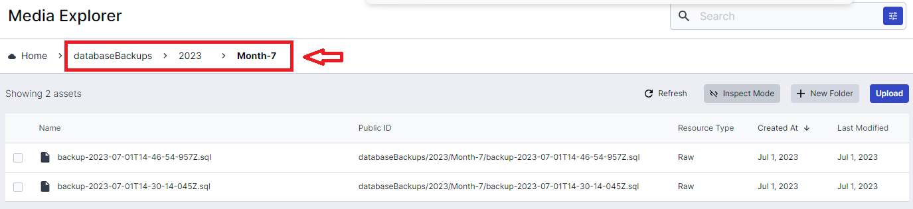
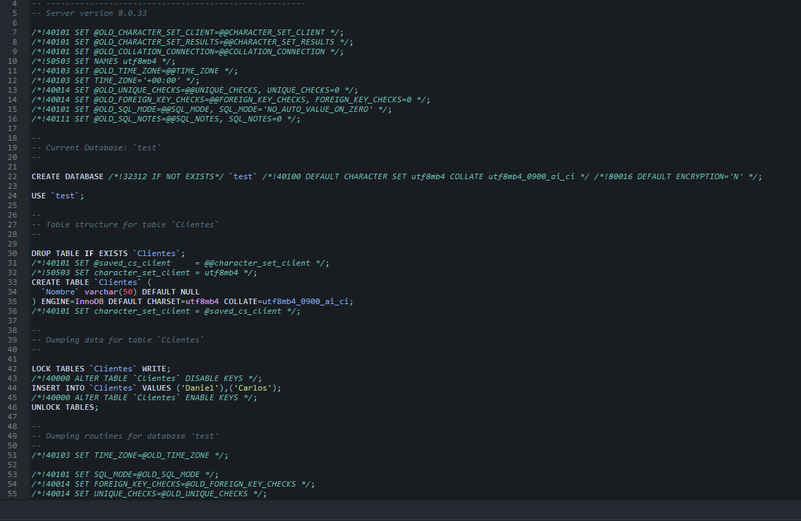

# MySql Backup - Cloudinary

Node.js application that performs scheduled backups of your MySQL database and uploads them to Cloudinary for secure storage. It utilizes a cron job to automate the backup process based on your desired frequency. The backups are saved in SQL format and can be easily restored if needed.

## Prerequisites

- Node.js and npm installed in the runtime environment.
- Valid Cloudinary credentials and access to a MySQL database.

## Steps

- Create a .env file in the project root(based on .env.example) and replace the values with your production keys(for production deployment, just create the keys on your server).
- Configure the cron job in index.ts according to your preferences(take a look at the config.ts file ). For example, if you want to perform daily backups at 12:00 PM, use the following value:
  <pre><code>  const job = new CronJob(env.CRON_SCHEDULE.DAILY, async () => {
  // ...
  });
</code></pre>

## Usage

The application will automatically perform scheduled backups of your database and upload them to Cloudinary. You can adjust the backup frequency by modifying the configuration in index.ts. If you want to run an immediate backup, you can uncomment the line void backup(); in index.ts before starting the cron job.

## Screenshots

### Cloudinary

The folder for backups will be automatically created with the following name: <b>databaseBackups/{currentYear}/Month-{currentMonth}</b>

### Sql backup script

